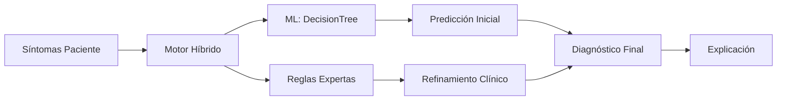

# Sistema Experto para el Diagnóstico de Enfermedades Respiratorias
**Autor:** Ever Loza – Centro Politécnico Superior Malvinas Argentinas

## 🎯 Objetivo
Este proyecto implementa un **sistema experto híbrido** que combina reglas médicas tradicionales con machine learning para asistir al personal de salud en el diagnóstico de enfermedades respiratorias comunes (asma, bronquitis, neumonía y EPOC) en Tierra del Fuego. 

**Características principales:**
- 🧠 **Sistema Experto**: Reglas SI-ENTONCES basadas en conocimiento médico (editables en `src/knowledge_base/reglas.json`)
- 🤖 **Machine Learning**: DecisionTreeClassifier para patrones complejos  
- 🎨 **Interfaz Moderna**: Frontend Next.js + Tailwind CSS
- 📊 **Explicabilidad**: Justificación clara de cada diagnóstico
- 🛡️ **Estructura profesional y limpia**: Solo archivos necesarios, sin duplicados ni residuos

## 🧠 Representación del Conocimiento
El conocimiento se extrajo mediante entrevista con un agente sanitario local y se representa en dos niveles:

1. **Reglas Expertas**: Formato JSON con estructura SI-ENTONCES (`src/knowledge_base/reglas.json`)
2. **Modelo ML**: Árbol de decisión entrenado con 1000 casos sintéticos

**Módulos clínicos organizados:**
- Evaluación clínica
- Factores de riesgo  
- Diagnóstico diferencial
- Clasificación de gravedad

## 🛠️ Arquitectura del Sistema

### **Enfoque Híbrido Inteligente**



### 📁 Estructura del Proyecto (Versión Final Limpia)

```
📁 Politecnico_Sistema_Experto/
├── README.md                # Documentación principal
├── requisitos.txt           # Dependencias Python
├── LIMPIEZA_REALIZADA.txt   # Evidencia de limpieza y estructura final
├── documentacion/           # Documentos académicos y justificación
├── src/
│   ├── knowledge_base/
│   │   ├── reglas.json      # Base de conocimiento SI-ENTONCES (editable)
│   │   ├── motor_inferencia.py # Motor de inferencia desacoplado
│   │   └── predict_model.py # Integración ML (scikit-learn)
│   └── webapp/
│       └── app.py           # API Flask (endpoints /diagnostico y /reglas)
├── frontend/                # Interfaz Next.js + Tailwind
│   └── ...                  # Componentes, páginas y estilos
└── ...                      # Otros archivos relevantes
```

## 🚀 Instalación y Uso

### Backend
```bash
cd src/webapp
python app.py
```

### Frontend
```bash
cd frontend
npm install
npm run dev
```

### Pruebas
```bash
pytest tests/
```

## 🔗 Endpoints RESTful

- `POST /diagnostico` — Recibe síntomas, retorna diagnóstico, explicación y regla disparada (o predicción ML si no hay coincidencia)
- `GET /reglas` — Lista todas las reglas SI-ENTONCES
- `POST /reglas` — Agrega una nueva regla a la base de conocimiento (JSON)

## 📝 Gestión y Edición de Reglas

- Las reglas SI-ENTONCES se encuentran en `src/knowledge_base/reglas.json` y pueden editarse manualmente o mediante el endpoint `/reglas`.
- Para agregar una regla desde el frontend, se recomienda implementar un formulario que consuma el endpoint `POST /reglas`.
- El motor de inferencia está desacoplado y evalúa reglas desde el JSON, permitiendo fácil mantenimiento y explicabilidad.

## 🧹 Observaciones de Limpieza

- Se eliminaron archivos y carpetas innecesarias: reglas antiguas en Python, duplicados, archivos `.DELETE_ME`, carpetas `__pycache__`.
- La estructura final es profesional, clara y lista para entrega académica.
- Ver detalles en `LIMPIEZA_REALIZADA.txt`.

## 📞 Contacto

**Ever Loza**  
Centro Politécnico Superior Malvinas Argentinas  
Tierra del Fuego, Argentina

---

Sistema experto híbrido listo para entrega profesional y académica. Para más detalles, consulta la documentación en la carpeta `documentacion/`.

