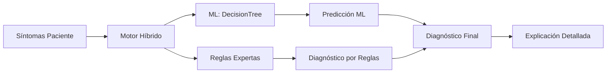

# Sistema Experto para el Diagnóstico de Enfermedades Respiratorias
**Autor:** Ever Loza – Centro Politécnico Superior Malvinas Argentinas

## Objetivo
Sistema experto que asiste al personal de salud en el diagnóstico de enfermedades respiratorias (asma, bronquitis, neumonía, EPOC, etc.) combinando reglas médicas SI-ENTONCES y machine learning, con interfaz web moderna y explicabilidad total.

---

## ¿Cómo Funciona?

1. **Ingreso de síntomas:**
   El usuario completa un formulario web intuitivo con síntomas y antecedentes.

2. **Motor de inferencia desacoplado:**
   El backend primero evalúa reglas SI-ENTONCES (editables en JSON). Si alguna regla se cumple, retorna el diagnóstico y una explicación médica clara.

3. **Respaldo con Machine Learning:**
   Si ninguna regla se dispara, un modelo ML (DecisionTree) predice el diagnóstico y explica los síntomas analizados.

4. **Explicabilidad:**
   Siempre se muestra al usuario la justificación del diagnóstico, ya sea por reglas o por ML.

5. **Gestión de reglas:**
   Las reglas pueden verse, agregarse y editarse desde la interfaz, sin tocar el código.

---

## Representación del Conocimiento
- **Reglas Expertas:** Formato JSON SI-ENTONCES, editable y desacoplado (`src/knowledge_base/reglas.json`).
- **Modelo ML:** Árbol de decisión entrenado con casos sintéticos para cubrir escenarios complejos.

---

## 🛠️ Arquitectura Profesional

- **Backend:** Python + Flask, motor de inferencia desacoplado, API RESTful, integración ML.
- **Frontend:** Next.js + Tailwind CSS, componentes responsivos, visualización clara y profesional.
- **Explicabilidad:** Explicación detallada de cada diagnóstico, visualización de reglas y resultados amigable.



---

## 📁 Estructura del Proyecto

```
Politecnico_Sistema_Experto/
├── README.md
├── requisitos.txt
├── documentacion/
├── src/
│   ├── knowledge_base/
│   │   └── reglas.json
│   ├── engine/
│   │   └── motor_inferencia.py
│   ├── ml_model/
│   │   └── predict_model.py
│   └── webapp/
│       └── app.py
├── frontend/
│   └── ... (componentes, páginas y estilos responsive)
└── ...
```

---

## Instalación y Uso

### Backend
```bash
python -m src.webapp.app
```

### Frontend
```bash
cd frontend
npm install
npm run dev
```

### Pruebas
```bash
pytest tests/
```

---

## Endpoints RESTful

- `POST /diagnostico` — Recibe síntomas, retorna diagnóstico y explicación (regla disparada o predicción ML).
- `GET /reglas` — Lista todas las reglas SI-ENTONCES.
- `POST /reglas` — Agrega una nueva regla a la base de conocimiento.

---

## Gestión y Edición de Reglas

- Las reglas SI-ENTONCES se editan fácilmente desde la interfaz o vía API.
- El motor de inferencia evalúa reglas desde el JSON, permitiendo mantenimiento y escalabilidad sin tocar el código.
- La interfaz permite agregar reglas con lenguaje natural y visualización clara.

---

## Responsive y Accesibilidad

- Interfaz optimizada para móvil, tablet y escritorio.
- Componentes y formularios adaptativos, colores suaves y alto contraste.
- Navegación y botones grandes, accesibles y amigables.

---

## Documentación y Soporte

- Consulta la carpeta `docs/` para detalles académicos, justificación y anexos.
- El sistema está listo para entrega profesional, defensa y ampliación futura.

---
