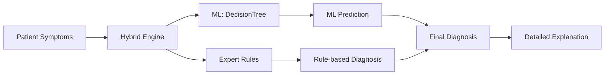
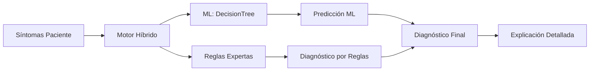

# 1# Expert System for Respiratory Disease Diagnosis
**Author:** Ever Loza – Centro Politécnico Superior Malvinas Argentinas

## Objective
Expert system that assists healthcare personnel in diagnosing respiratory diseases (asthma, bronchitis, pneumonia, COPD, etc.) by combining IF-THEN medical rules and machine learning, with a modern web interface and full explainability.

---

## How does it work?

1. **Symptom input:**
   The user fills out an intuitive web form with symptoms and background information.

2. **Decoupled inference engine:**
   The backend first evaluates IF-THEN rules (editable in JSON). If a rule matches, it returns the diagnosis and a clear medical explanation.

3. **Machine Learning backup:**
   If no rule matches, an ML model (DecisionTree) predicts the diagnosis and explains the analyzed symptoms.

4. **Explainability:**
   The user always sees the justification for the diagnosis, whether by rules or ML.

5. **Rule management:**
   Rules can be viewed, added, and edited from the interface, without touching the code.

---

## Knowledge Representation
- **Expert Rules:** Editable and decoupled IF-THEN JSON format (`src/knowledge_base/reglas.json`).
- **ML Model:** Decision tree trained with synthetic cases to cover complex scenarios.

---

## 🛠️ Professional Architecture

- **Backend:** Python + Flask, decoupled inference engine, RESTful API, ML integration.
- **Frontend:** Next.js + Tailwind CSS, responsive components, clear and professional visualization.
- **Explainability:** Detailed explanation of each diagnosis, user-friendly rule/result visualization.



---

## 📁 Project Structure

```
Politecnico_Sistema_Experto/
├── README.md
├── requirements.txt
├── docs/
├── src/
│   ├── knowledge_base/
│   │   └── reglas.json
│   ├── engine/
│   │   └── motor_inferencia.py
│   ├── ml_model/
│   │   └── predict_model.py
│   └── webapp/
│       └── app.py
├── frontend/
│   └── ... (components, pages and responsive styles)
└── ...
```

---

## Installation & Usage

### Backend
```bash
pip install -r requirements.txt
python -m src.webapp.app
```

### Frontend
```bash
cd frontend
npm install
npm run dev
```

### Tests
```bash
pytest tests/
```

---

## RESTful Endpoints

- `POST /diagnostico` — Receives symptoms, returns diagnosis and explanation (triggered rule or ML prediction).
- `GET /reglas` — Lists all IF-THEN rules.
- `POST /reglas` — Adds a new rule to the knowledge base.

---

## Rule Management & Editing

- IF-THEN rules can be easily edited from the interface or via API.
- The inference engine evaluates rules from JSON, allowing maintenance and scalability without touching the code.
- The interface allows adding rules in natural language and clear visualization.

---

## Responsive & Accessibility

- Interface optimized for mobile, tablet, and desktop.
- Adaptive components and forms, soft colors and high contrast.
- Large, accessible, and user-friendly navigation and buttons.

---

## Documentation & Support

- See the `docs/` folder for academic details, justification, and annexes.
- The system is ready for professional delivery, defense, and future expansion.

---

## Built by Ever Loza ([never130](https://github.com/never130)) — Software & AI Developer

Portfolio: [everloza-porfolio.netlify.app](https://everloza-porfolio.netlify.app)

---

# 2# Sistema Experto para el Diagnóstico de Enfermedades Respiratorias
**Autor:** Ever Loza – Centro Politécnico Superior Malvinas Argentinas

## Objetivo
Sistema experto que asiste al personal de salud en el diagnóstico de enfermedades respiratorias (asma, bronquitis, neumonía, EPOC, etc.) combinando reglas médicas SI-ENTONCES y machine learning, con interfaz web moderna y explicabilidad total.

---

## ¿Cómo Funciona?

1. **Ingreso de síntomas:**
   El usuario completa un formulario web intuitivo con síntomas y antecedentes.

2. **Motor de inferencia desacoplado:**
   El backend primero evalúa reglas SI-ENTONCES (editables en JSON). Si alguna regla se cumple, retorna el diagnóstico y una explicación médica clara.

3. **Respaldo con Machine Learning:**
   Si ninguna regla se dispara, un modelo ML (DecisionTree) predice el diagnóstico y explica los síntomas analizados.

4. **Explicabilidad:**
   Siempre se muestra al usuario la justificación del diagnóstico, ya sea por reglas o por ML.

5. **Gestión de reglas:**
   Las reglas pueden verse, agregarse y editarse desde la interfaz, sin tocar el código.

---

## Representación del Conocimiento
- **Reglas Expertas:** Formato JSON SI-ENTONCES, editable y desacoplado (`src/knowledge_base/reglas.json`).
- **Modelo ML:** Árbol de decisión entrenado con casos sintéticos para cubrir escenarios complejos.

---

## 🛠️ Arquitectura Profesional

- **Backend:** Python + Flask, motor de inferencia desacoplado, API RESTful, integración ML.
- **Frontend:** Next.js + Tailwind CSS, componentes responsivos, visualización clara y profesional.
- **Explicabilidad:** Explicación detallada de cada diagnóstico, visualización de reglas y resultados amigable.



---

## 📁 Estructura del Proyecto

```
Politecnico_Sistema_Experto/
├── README.md
├── requirements.txt
├── docs/
├── src/
│   ├── knowledge_base/
│   │   └── reglas.json
│   ├── engine/
│   │   └── motor_inferencia.py
│   ├── ml_model/
│   │   └── predict_model.py
│   └── webapp/
│       └── app.py
├── frontend/
│   └── ... (componentes, páginas y estilos responsive)
└── ...
```

---

## Instalación y Uso

### Backend
```bash
pip install -r requirements.txt
python -m src.webapp.app
```

### Frontend
```bash
cd frontend
npm install
npm run dev
```

### Pruebas
```bash
pytest tests/
```

---

## Endpoints RESTful

- `POST /diagnostico` — Recibe síntomas, retorna diagnóstico y explicación (regla disparada o predicción ML).
- `GET /reglas` — Lista todas las reglas SI-ENTONCES.
- `POST /reglas` — Agrega una nueva regla a la base de conocimiento.

---

## Gestión y Edición de Reglas

- Las reglas SI-ENTONCES se editan fácilmente desde la interfaz o vía API.
- El motor de inferencia evalúa reglas desde el JSON, permitiendo mantenimiento y escalabilidad sin tocar el código.
- La interfaz permite agregar reglas con lenguaje natural y visualización clara.

---

## Responsive y Accesibilidad

- Interfaz optimizada para móvil, tablet y escritorio.
- Componentes y formularios adaptativos, colores suaves y alto contraste.
- Navegación y botones grandes, accesibles y amigables.

---

## Documentación y Soporte

- Consulta la carpeta `docs/` para detalles académicos, justificación y anexos.
- El sistema está listo para entrega profesional, defensa y ampliación futura.

---

## Built by Ever Loza ([never130](https://github.com/never130)) — Software & AI Developer

Portafolio: [everloza-porfolio.netlify.app](https://everloza-porfolio.netlify.app)
