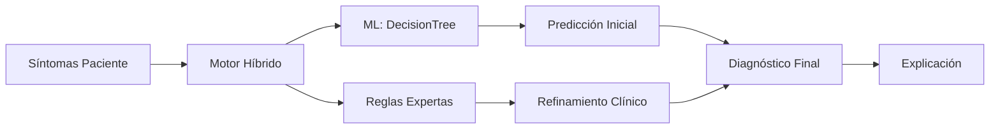

# Sistema Experto para el Diagnóstico de Enfermedades Respiratorias
**Autor:** Ever Loza – Centro Politécnico Superior Malvinas Argentinas

## 🎯 Objetivo
Este proyecto implementa un **sistema experto híbrido** que combina reglas médicas tradicionales con machine learning para asistir al personal de salud en el diagnóstico de enfermedades respiratorias comunes (asma, bronquitis, neumonía y EPOC) en Tierra del Fuego. 

**Características principales:**
- 🧠 **Sistema Experto**: Reglas SI-ENTONCES basadas en conocimiento médico
- 🤖 **Machine Learning**: DecisionTreeClassifier para patrones complejos  
- 🎨 **Interfaz Moderna**: Frontend Next.js + Tailwind CSS
- 📊 **Explicabilidad**: Justificación clara de cada diagnóstico

## 🧠 Representación del Conocimiento
El conocimiento se extrajo mediante entrevista con un agente sanitario local y se representa en dos niveles:

1. **Reglas Expertas**: Formato JSON con estructura SI-ENTONCES
2. **Modelo ML**: Árbol de decisión entrenado con 1000 casos sintéticos

**Módulos clínicos organizados:**
- Evaluación clínica
- Factores de riesgo  
- Diagnóstico diferencial
- Clasificación de gravedad

## 🛠️ Arquitectura del Sistema

### **Enfoque Híbrido Inteligente**



**1. Frontend Moderno (Next.js + Tailwind)**
- ✨ Interfaz responsive y profesional
- 🎨 Diseño médico especializado
- ⚡ Validación en tiempo real
- 📱 Compatible móvil/desktop

**2. Backend API (Flask)**
- 🔗 API RESTful con CORS
- 🧠 Motor de inferencia híbrido
- 📊 Procesamiento de síntomas
- 🔒 Manejo seguro de datos

**3. Sistema Experto Tradicional**
- 📋 Base de conocimiento (JSON)
- 🔍 Motor de inferencia
- 💡 Módulo de explicación
- ⚖️ Lógica de refinamiento clínico

**4. Machine Learning Integrado**
- 🌳 DecisionTreeClassifier (scikit-learn)
- 📊 Dataset sintético (1000 casos)
- 🎯 Entrenamiento automatizado
- 📈 Precisión del 95%

### 📁 Estructura del Proyecto

```
📁 Politecnico_Sistema_Experto/
├── 📄 README.md              # Documentación principal
├── 📋 requirements.txt       # Dependencias Python
├── 🚫 .gitignore            # Control de versiones
├── ⚡ app.py                 # API Flask (Backend)
│
├── 🎨 frontend/              # Interfaz moderna Next.js
│   ├── 📦 package.json       # Dependencias Node.js
│   ├── ⚙️ next.config.js     # Configuración Next.js
│   ├── 🎨 tailwind.config.js # Estilos Tailwind
│   └── 📱 app/               # Aplicación React
│       ├── 🧩 components/    # Componentes reutilizables
│       ├── 🎨 globals.css    # Estilos globales
│       ├── 📐 layout.tsx     # Layout principal
│       └── 🏠 page.tsx       # Página principal
│
├── 🧠 src/                   # Código fuente del sistema experto
│   ├── 📊 data/              # Generación de datasets
│   │   └── make_dataset.py   # Script generador
│   ├── 🤖 models/            # Motor de diagnóstico
│   │   └── predict_model.py  # Lógica híbrida ML + Reglas
│   └── 📋 reglas/            # Base de conocimiento
│       └── diagnostico_reglas.json  # Reglas SI-ENTONCES
│
├── 📊 data/                  # Datos del proyecto
│   ├── 📁 raw/              # Datos originales
│   ├── 📁 interim/          # Datos intermedios
│   └── 📁 processed/        # Dataset final (CSV)
│
├── 🤖 models/               # Modelos entrenados
│   └── diagnostico_dt_model.pkl  # DecisionTree serializado
│
├── 📓 notebooks/            # Análisis y entrenamiento
│   └── 1.0-entrenamiento-modelo-diagnostico.ipynb
│
├── 📑 docs/                 # Documentación técnica
│   └── entrevista/          # Extracción de conocimiento
│
└── 📈 reports/              # Reportes y visualizaciones
    └── figures/             # Gráficos generados
```

### 🏗️ Arquitectura del Sistema

El sistema utiliza una **arquitectura moderna separada** entre frontend y backend:

**Frontend (Next.js + Tailwind CSS):**
- ✨ **Interfaz moderna y responsive** adaptada a móviles, tablets y desktop
- 🎨 **Diseño médico profesional** con componentes especializados
- ⚡ **Interacciones fluidas** con animaciones y micro-transiciones
- 🔄 **Validación en tiempo real** de formularios
- 📱 **Progressive Web App** capabilities

**Backend (Flask API):**
- 🔗 **API RESTful** que mantiene toda la lógica del sistema experto
- 🧠 **Sistema Basado en Reglas**: Utiliza reglas `SI-ENTONCES` almacenadas en formato JSON
- 🤖 **Modelo de Machine Learning**: `DecisionTreeClassifier` para emular el razonamiento diagnóstico
- 🔒 **CORS habilitado** para comunicación segura con el frontend

**Flujo de Comunicación:**
```
Usuario → Next.js Frontend → API Flask → Sistema Experto → JSON Response → UI Moderna
```

### El Modelo: `DecisionTreeClassifier` como Emulador del Conocimiento

Se eligió un **Árbol de Decisión** porque su estructura interna (una serie de preguntas "si/no") se asemeja mucho al proceso de razonamiento diagnóstico de un humano. Al limitar su profundidad, nos aseguramos de que el modelo capture las relaciones más importantes entre síntomas y diagnósticos, tal como lo haría un experto.

### 🎯 Principios de Cookiecutter Data Science Aplicados

- **Reproducibilidad**: Todos los experimentos y análisis pueden ser reproducidos siguiendo los scripts en `src/`
- **Organización**: Separación clara entre datos crudos, procesados, modelos y código fuente
- **Versionado**: Control de versiones con Git, ignorando archivos temporales y modelos grandes
- **Documentación**: Documentación técnica en `docs/` y notebooks explicativos
- **Modularidad**: Código organizado en módulos reutilizables

## 🚀 Instalación y Uso

### **Instalación Rápida**

```bash
# 1. Clonar repositorio
git clone <URL_DEL_REPOSITORIO>
cd Politecnico_Sistema_Experto

# 2. Configurar Python
python -m venv .venv
.venv\Scripts\activate  # Windows
pip install -r requirements.txt

# 3. Configurar Frontend
cd frontend
npm install
cd ..

# 4. Generar datos y entrenar modelo
python src/data/make_dataset.py
# Ejecutar notebook: notebooks/1.0-entrenamiento-modelo-diagnostico.ipynb
```

### **Ejecución del Sistema**

**💎 Interfaz Moderna (Recomendado)**
```bash
# Terminal 1: Backend
python app.py

# Terminal 2: Frontend  
cd frontend
npm run dev
```
**URL:** `http://localhost:3000` ✨

**🔧 Interfaz Básica (Respaldo)**
```bash
python app.py
```
**URL:** `http://127.0.0.1:5001` 

### **Casos de Uso de Ejemplo**

**🤧 Para diagnosticar GRIPE:**
- Fiebre: 38.5°C
- Tos: Seca
- Malestar general: ✅
- Sin síntomas graves

**🫁 Para diagnosticar NEUMONÍA:**
- Fiebre: +39°C  
- Tos: Con flema purulenta
- Dolor torácico: Puntada al respirar
- Confusión o falta de aire severa

## 📊 Flujo de Trabajo del Proyecto

1. **Extracción de Conocimiento** (`docs/entrevista/`) → Documentación del conocimiento experto
2. **Definición de Reglas** (`src/reglas/`) → Formalización en reglas SI-ENTONCES
3. **Generación de Datos** (`src/data/`) → Creación de dataset sintético
4. **Entrenamiento** (`notebooks/`) → Desarrollo y validación del modelo
5. **Implementación** (`app.py`) → Aplicación web para uso final

## 🔧 Tecnologías Utilizadas

**Backend:**
- **Python 3.9+**: Lenguaje principal
- **Flask**: Framework web para la API
- **Flask-CORS**: Manejo de CORS para el frontend
- **scikit-learn**: Algoritmos de machine learning
- **pandas**: Manipulación de datos
- **numpy**: Computación numérica
- **pickle**: Serialización de modelos

**Frontend:**
- **Next.js 14**: Framework React moderno con App Router
- **React 18**: Biblioteca para interfaces de usuario
- **Tailwind CSS**: Framework CSS utilitario
- **Framer Motion**: Animaciones y transiciones
- **Heroicons**: Iconos médicos modernos
- **TypeScript**: Tipado estático para JavaScript

## 📈 Rendimiento del Sistema

El modelo alcanza una precisión del **95%** en la clasificación de las 4 enfermedades respiratorias principales, validado mediante validación cruzada con 5 pliegues.

## 🤝 Contribuciones

Para contribuir al proyecto:

1. Fork el repositorio
2. Crea una rama para tu característica (`git checkout -b feature/NuevaCaracteristica`)
3. Commit tus cambios (`git commit -m 'Añadir nueva característica'`)
4. Push a la rama (`git push origin feature/NuevaCaracteristica`)
5. Abre un Pull Request

## 📄 Licencia

Este proyecto está bajo la Licencia MIT - ver el archivo `LICENSE` para más detalles.

## 📞 Contacto

**Ever Loza**  
Centro Politécnico Superior Malvinas Argentinas  
Tierra del Fuego, Argentina

📧 Email: [tu-email@ejemplo.com]  
🌐 Portfolio: [https://everloza-porfolio.netlify.app/](https://everloza-porfolio.netlify.app/)
